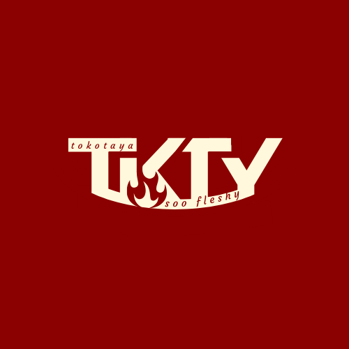

# TKTY Ecommerce Revamp

  

> Reviving a 2-year-old Next.js ecommerce app into a modern digital store for **TKTY**, a 10-year-old food processing brand known for its smoked catfish.  
> Building in public → sharing code + product decisions along the way.

---

## 🔗 Live Links
- 🚧 Demo (coming soon)  
- 📖 Build Log: [Follow on LinkedIn](https://linkedin.com/in/yourprofile) | [Follow on X](https://x.com/yourhandle)

---

## 🛠️ Tech Stack
- [Next.js](https://nextjs.org/) – framework
- [TypeScript](https://www.typescriptlang.org/) – safer, clearer code
- [Tailwind CSS](https://tailwindcss.com/) + [shadcn/ui](https://ui.shadcn.com/) – styling & components
- [Framer Motion](https://www.framer.com/motion/) – animations
- [Firebase](https://firebase.google.com/) – auth, database, hosting
- [Paystack](https://paystack.com/) – payments

---

## ✨ Features (MVP)
**User**
- Browse products & services
- Cart + checkout (no login required)
- Seamless payments with delivery fee

**Admin**
- Separate admin subdomain
- List/manage products & services
- View/confirm orders

---

## 📅 Roadmap
- ✅ Repo cleanup + TypeScript migration  
- ⬜ Landing page redesign  
- ⬜ Product + services pages  
- ⬜ Admin dashboard MVP  
- ⬜ Analytics & delivery options  

---

## 🚀 About TKTY
TKTY has been supplying clean, tasty smoked catfish for **10+ years**.  
No digital presence — just word of mouth and referrals.  
This project is their first official step into digital commerce.

---

## 🤝 Contributing
This is a **public build log**, not an open-source project.  
But feel free to open issues, suggest improvements, or drop feedback.

---

## 📩 Contact
- Built & documented by [Isaac Oyedele](https://linkedin.com/in/isaacoyedele)  
- Reach me on [X](https://x.com/hyzeekoyedele) for dev/product discussions
